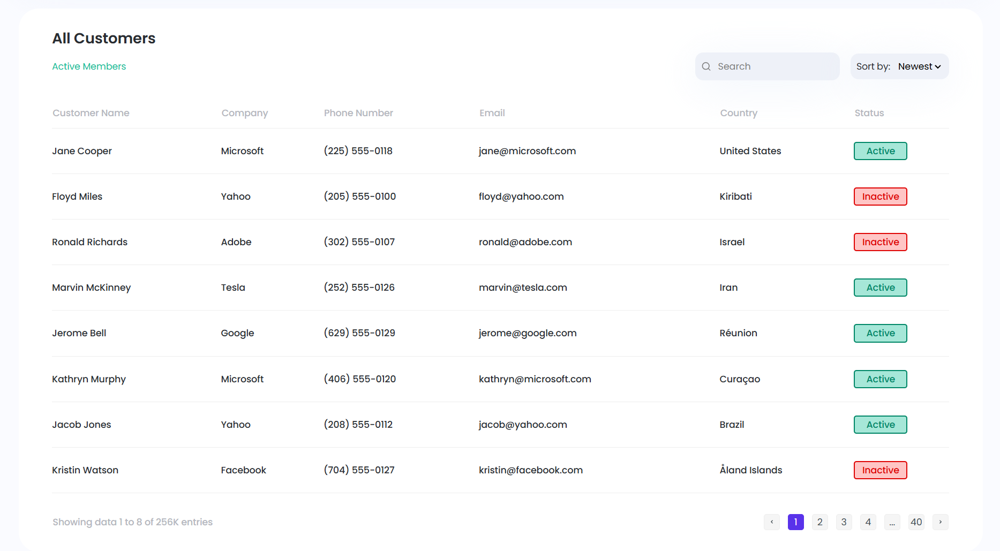

# 📊 CRM Dashboard — Customers

Learning project focused on practicing table layout and responsive design

🔗 [Live Demo](https://sofi-dobriak.github.io/crm-dashboard-customers/)

---



---

📱 Features (markup only)

- Fully responsive layout for desktop, tablet, and mobile
- Customer table: name, company, phone, email, country, status
- Dashboard stats section with small KPI cards
- Pagination UI to browse customer records

---

🛠 Tech Stack

- Vite — fast development setup
- HTML — clean structure
- CSS Modules — scoped styling for each component

---

## 🚀 Run Locally

1. Clone the repository:
   ```bash
   git clone https://github.com/sofi-dobriak/crm-dashboard-customers.git
2. Navigate to the project folder:
    ```bash
    cd crm-dashboard-customers
3. Install dependencies:
    ```bash
    npm install
4. Start the development server:
    ```bash
    npm run dev

5. Open in your browser:
    ```bash
    http://localhost:5173
---

👩‍💻 Author: Sofi Dobriak